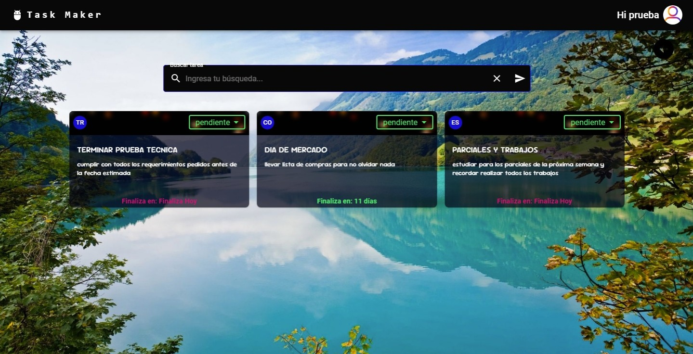
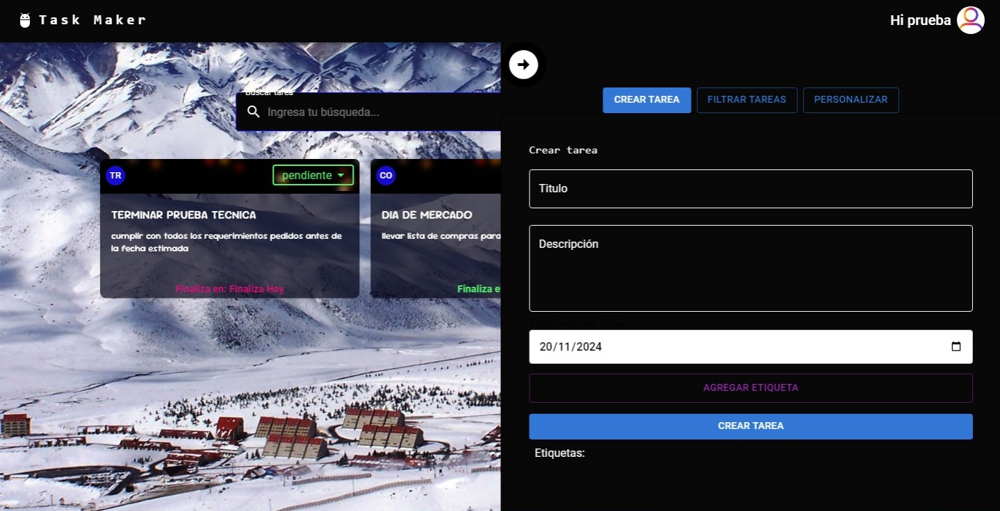

# Aplicación de Gestión de Tareas

¡Bienvenido al desafío de desarrollo de una aplicación web de gestión de tareas! Este proyecto fue creado como prueba técnica para evaluar habilidades en desarrollo Fullstack. 

## Descripción

La aplicación permite a los usuarios registrarse, iniciar sesión y gestionar sus tareas personales de forma eficiente. Los usuarios pueden crear tareas con diferentes estados y etiquetas, eliminarlas y filtrar la lista de tareas según sus necesidades. Tambien cuenta con un sistema de correo electronico el cual consta de un email que se envia a los usuarios con tareas pendientes o en progreso póximas a finalizar. 

## Tabla de Contenidos

- [Características](#características)
- [Tecnologías Utilizadas](#tecnologías-utilizadas)
- [Requisitos](#requisitos)
- [Instalación](#instalación)
- [Configurar Prisma](#configurar-Prisma)
- [Configurar SQlite](#configurar-sqlite)
- [Uso](#uso)
- [Contribución](#contribución)
- [Licencia](#licencia)
- [Anotaciones](#anotaciones)

## Características

- **Registro de Usuarios**
  - Formulario de registro con validaciones para nombre de usuario, correo electrónico y contraseña.
  - Almacenamiento seguro de contraseñas en la base de datos.

- **Inicio de Sesión**
  - Autenticación de usuarios mediante JWT.

- **Gestión de Tareas**

  - **Crear Tareas**: Permite a los usuarios crear tareas con un título, una descripción, una fecha límite y múltiples etiquetas.
  - **Estados de Tareas**: Las tareas pueden tener diferentes estados como "trabajo", "hogar" y "completada".
  - **Eliminar Tareas**: Posibilidad de eliminar tareas de la lista.
  - **Etiquetas**: Las tareas pueden ser etiquetadas con múltiples etiquetas (ej: "trabajo", "urgente") para una mejor organización.
  - **Filtro de Etiquetas**: Permite a los usuarios filtrar las tareas por una o varias etiquetas a la vez.
  - **Personalización de Fondos**: Los usuarios pueden personalizar los fondos de pantalla de la aplicación.

  
  
  
  
  
  

## Tecnologías Utilizadas

- **Frontend**
  - React con TypeScript
  - Material UI para la interfaz de usuario
  - Diseño responsive y manejo de estado

- **Backend**
  - Node.js con Express.js
  - API RESTful para la comunicación entre frontend y backend
  - Base de datos SQLite
  - Implementación de autenticación JWT

## Requisitos

- Node.js
- npm (Node Package Manager)

## Instalación

1. Clona el repositorio: git clone (https://github.com/nestornovella/Prueba-Tecnica-StoneIt-Cloud.git)

2. Instala las dependencias para el frontend:
- cd client
- npm install

3. Instala las dependencias para el backend:
- cd api
- npm install

## compilador  
- **compilar el proyecto (necesatio para que funcione)**
npm run build:dev

# establecer la variable de entorno DATABASE_URL en tu archivo .env.

- **api**
- DATABASE_URL="file:../../db/database.db"
- SECRET_KEY_JWT='dscwksa23sdaw'
- EMAIL_USER= "configurar email de usuario para poder usar nodemailer"
- EMAIL_PASS= "crear contraseña de api de email de usuario"

- **client**
- VITE_AUTH_URL= http://localhost:3001/auth/
- VITE_USER_URL= http://localhost:3001/user/
- VITE_TASK_URL= http://localhost:3001/task/

## Uso

1. Para iniciar el backend, navega a la carpeta api y ejecuta:
npm run dev

2. Para iniciar el frontend, navega a la carpeta client y ejecuta:
npm run dev

3. ara ejecutar los test del backend, navega a la carpeta api y ejecuta:
npm run test

4. Accede a la aplicación en tu navegador en http://localhost:3001.

## Contribucion

Haz un fork del repositorio.
Crea una rama para tu característica: git checkout -b feature/nueva-caracteristica.
Realiza tus cambios y haz commit: git commit -m 'Añadir nueva característica'.
Haz push a la rama: git push origin feature/nueva-caracteristica.
Abre un Pull Request.

## Licencia
Este proyecto está bajo la Licencia MIT. Consulta el archivo LICENSE para más información.

## Anotaciones

el sistema de correos electronicos queda instalado para cuando quiera ponerse en uso, solo se debe agregar el email del usuario + la contraseña de api (revisar variables de entorno) para ponerlo en funcionamiento.
